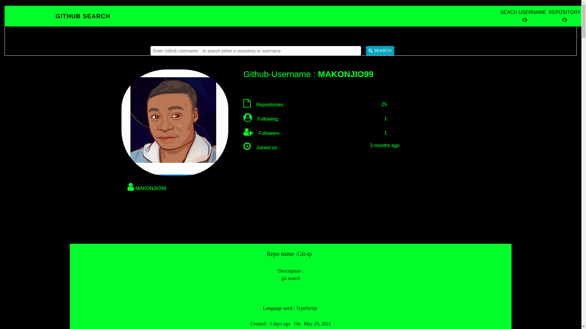

# Git :

This project was generated with [Angular CLI](https://github.com/angular/angular-cli) version 9.1.8.

## Development server :

Run `ng serve` for a dev server. Navigate to `http://localhost:4200/`. The app will automatically reload if you change any of the source files.

## Code scaffolding :

Run `ng generate component component-name` to generate a new component. You can also use `ng generate directive|pipe|service|class|guard|interface|enum|module`.

## BDD :

* A user can search for github users by simply typing their usernames
* A user is able to explore profiles of different github users

## SCREENSHOT:

### Live Site:
View [live](https://makonjio99.github.io/Git-ip/)

|AUTHOR | CONTACT-Email|Phone|
|:------|:------------|:-----|
|Francis Makonjio|francismakonjio2@gmail.com|+254790445180|

##  Licence Information

* This software application is under MIT licence